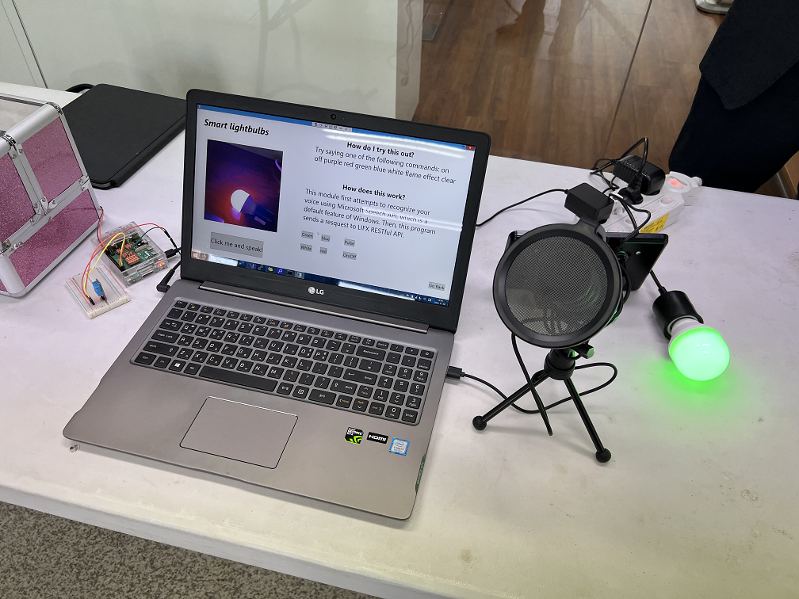

# IoTExhibitionWPF

NLCS Jeju Computer Science Enrichment Week Exhibition source code.

This exhibition was aimed to demonstrate the basic capabilites of IoT. This exhbition was composed of

* A router (which is basically just a hotspot)
* 'Controller' raspberry Pi (this involved two python flask servers, serving readings from DHT11 temp/humidity sensor and a magnatic (door) sensor; however, I could not find the source code for that since the SD card decided to destroy itself)
* 'Kiosk' device for controlling things and testing things out

This repo includes the source code for the Kiosk.

Features
==========
* Door open/close monitor using magnetic sensor
* Temperature/humidity sensor using a sensor (DHT11)
* Smart lightbulb controlling via LIFX
* Voice control for above using Windows Speech Recogntion API

You can find the demonstartion at https://www.youtube.com/watch?v=NBYgK75RZQE.
